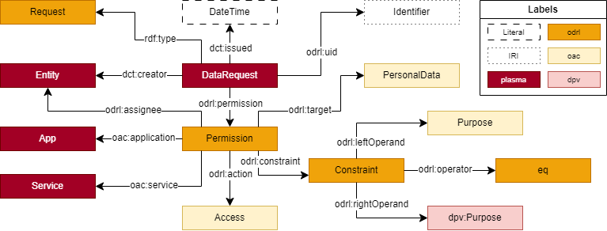
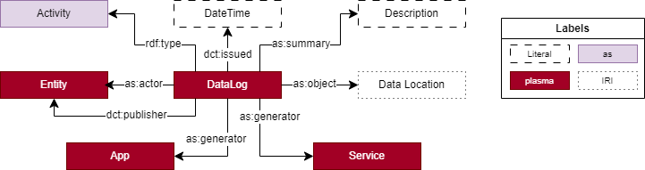
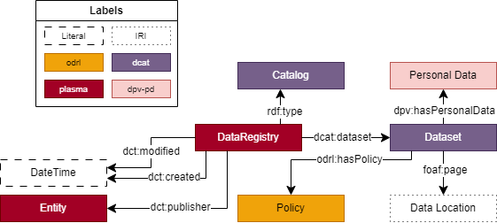

# Ontology Design Patterns (ODPs) for PLASMA

**Table of Contents**

- [Ontology Design Patterns (ODPs) for PLASMA](#ontology-design-patterns-odps-for-plasma)
  * [Namespaces](#namespaces)
  * [ODPs for policies](#odps-for-policies)
    + [ODP for data requests](#odp-for-data-requests)
  * [ODPs for logs](#odps-for-logs)
    + [ODP for data logs](#odp-for-data-log)
  * [ODPs for registries](#odps-for-registries)
    + [ODP for data registries](#odp-for-data-registry)

## Namespaces

| Prefix | Namespace                                 |
|--------|-------------------------------------------|
|as      |https://www.w3.org/ns/activitystreams#     |
|dcat    |http://www.w3.org/ns/dcat#                 |
|dcterms |http://purl.org/dc/terms/                  |
|dpv     |https://w3id.org/dpv#                      |
|dpv-pd  |https://w3id.org/dpv/dpv-pd#               |
|foaf    |http://xmlns.com/foaf/0.1/                 |
|oac     |https://w3id.org/oac#                      |
|odrl    |http://www.w3.org/ns/odrl/2/               |
|plasma  |https://w3id.org/plasma#                   |
|rdf     |http://www.w3.org/1999/02/22-rdf-syntax-ns#|
|rdfs    |http://www.w3.org/2000/01/rdf-schema#      |
|xsd     |http://www.w3.org/2001/XMLSchema#          |
|        |https://example.com/                       |

## ODPs for policies

### ODP for data requests

The pattern for a data request policy aims to answer the following competency 
questions:

**(CQ1)** What is the unique identifier of the policy?

**(CQ2)** Who is the creator of the policy?

**(CQ3)** When was the policy issued?

**(CQ4)** Who is the assignee of the policy?

**(CQ5)** What application/service is being used to access the data?

**(CQ6)** What access mode is being requested?

**(CQ7)** What personal data is being accessed?

**(CQ8)** What is the purpose for accessing the data?

A visualisation of the pattern is presented in the figure below:



The pattern is used in the example below to represent a data request policy 
created by `UserA` with `ApplicationA` to `Read` `Age` data from `UserB` to 
conduct research for an academic project.

```turtle
:Request1 a odrl:Request, plasma:DataRequest;
  odrl:uid :Request1 ;
  odrl:profile oac: ;
  dcterms:description "Request to use age data for academic research." ;
  dcterms:creator :UserA ;
  dcterms:issued "2023-05-08T18:15:56"^^xsd:dateTime ;
  odrl:permission [
    odrl:assignee :UserB ;
    oac:application :ApplicationA ;
    odrl:action oac:Read ;
    odrl:target oac:Age ;
    odrl:constraint [
      dcterms:title "Purpose for access is to conduct research in an academic project." ;
      odrl:leftOperand oac:Purpose ;
      odrl:operator odrl:eq ;
      odrl:rightOperand dpv:AcademicResearch ] ] .

:UserA a plasma:User .

:UserB a plasma:DataSubject .

:ApplicationA a plasma:App .
```

Example available at [data-request.ttl](./data-request.ttl).

## ODPs for logs

### ODP for data logs

The pattern for a data log aims to answer the following competency questions:

**(CQ1)** What type of action, e.g., create, update, erase, is being performed to the data?

**(CQ2)** Who is the entity interacting with the data?

**(CQ3)** Who is the entity publishing the log?

**(CQ4)** When was the log issued?

**(CQ5)** Where is the data being stored?

**(CQ6)** What application/service is being used to generate the data, if any?

A visualisation of the pattern is presented in the figure below:



The pattern is used in the example below to represent a data log generated and 
published by `:AppA` and `:AppAProvider`, respectively, related to the `as:Create`
activity of the `https://solidweb.me/besteves4/energyConsumption/july-2023.ttl` 
resource, created by Beatriz (`https://solidweb.me/besteves4/profile/card#me`). 

```turtle
:DataLog1 a plasma:DataLog, as:Create ;
  dcterms:issued "2023-07-02T23:01:15"^^xsd:dateTime ;
  as:summary "Beatriz created a new resource that was added to her Pod" ;
  as:object <https://solidweb.me/besteves4/energyConsumption/july-2023.ttl> ;
  as:actor <https://solidweb.me/besteves4/profile/card#me> ;
  as:generator :AppA ;
  dcterms:publisher :AppAProvider .

:AppA a plasma:App .

:AppAProvider a plasma:AppProvider .
```

Example available at [data-log.ttl](./data-log.ttl).

## ODPs for registries

### ODP for data registries

The pattern for a data registry aims to answer the following competency 
questions:

**(CQ1)** Who is the maintaining the registry?

**(CQ2)** When was the registry created/updated?

**(CQ3)** What types of data are available?

**(CQ4)** Where is a specific type of data being stored?

**(CQ5)** What policy is associated with the data?

A visualisation of the pattern is presented in the figure below:



The pattern is used in the example below to record a dataset with `Contact` 
data, stored at `https://solidweb.me/besteves4/personalContacts/contactList.ttl` 
which has a policy associated with it.

```turtle
:DataRegistry a dcat:Catalog ;
  dcterms:created "2023-07-01T13:21:18"^^xsd:dateTime ;
  dcterms:publisher :DataRegistryServiceProvider ;
  dcat:dataset :Dataset_0001 .

:DataRegistryServiceProvider a plasma:ServiceProvider .

:Dataset_0001 a dcat:Dataset ;
  dpv:hasPersonalData dpv-pd:Contact ;
  foaf:page <https://solidweb.me/besteves4/personalContacts/contactList.ttl> ;
  odrl:hasPolicy :Policy2 .

:Policy2 a odrl:Policy .
```

Example available at [data-registry.ttl](./data-registry.ttl).